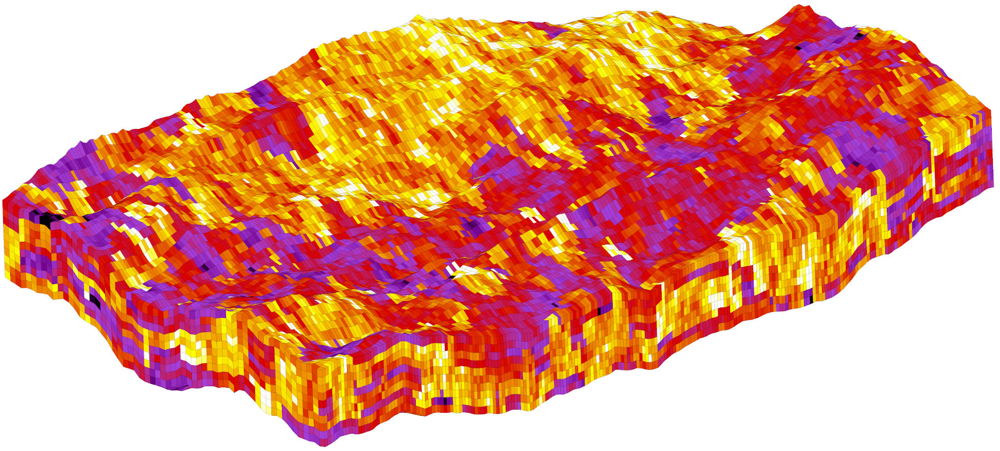

# spe10grdecl

Generate GRDECL file with corner-point geometry for SPE10 test case with hard-coded grid transformation.

Download SPE10 data from https://www.spe.org/web/csp/datasets/set02.htm#download and put .dat files into the folder with the executable.

Usage: ./spe10grdecl output.grdecl

Result of: ./spe10grdecl  test2.grdecl 0.25 0 60 0 220 55 65

 
